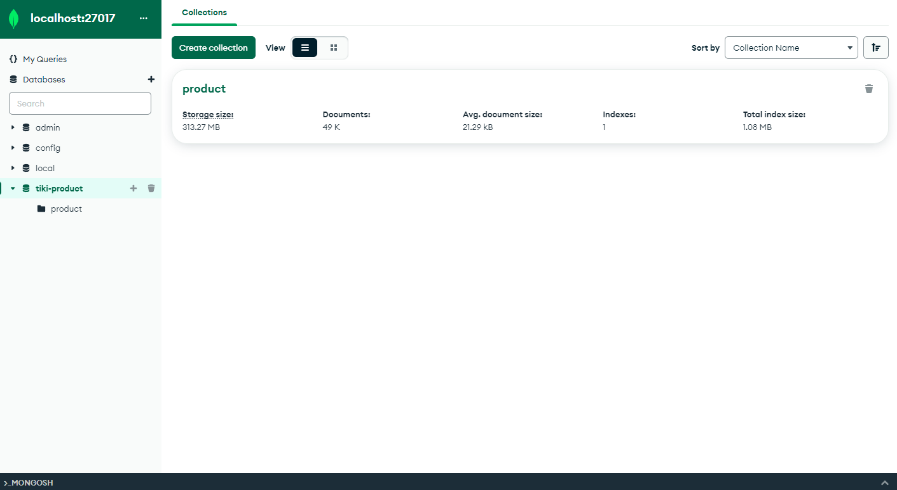
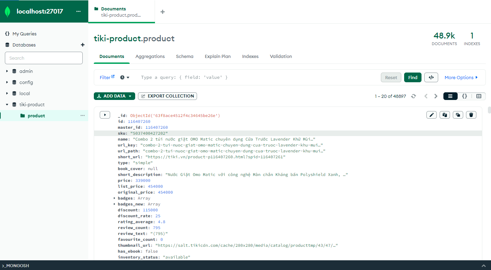
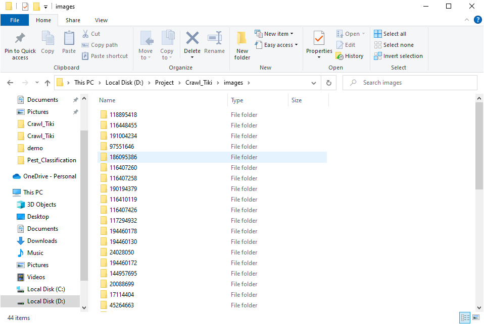
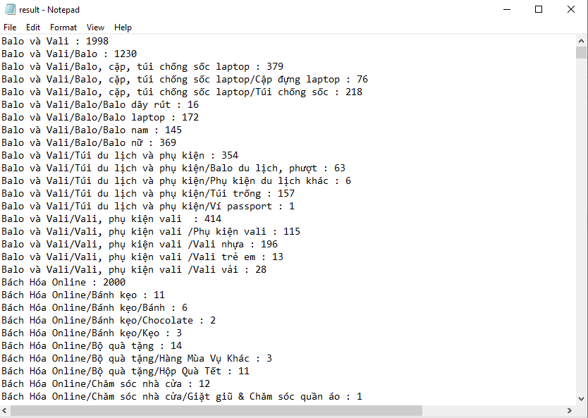

# [Python + MongoDB] Crawl products in Tiki

## Introduction

Bài toán: Lấy toàn bộ sản phẩm trên các danh mục của trang [tiki.vn](https://tiki.vn/) để sử dụng cho nhiều mục đích.

Yêu cầu : 
1. Dữ liệu được crawl về sẽ lưu trong MongoDB
2. Đánh index để hỗ trợ tìm kiếm thông tin trên trường “short_description” được nhanh chóng. Ví dụ: Query từ “hộp sữa” MongoDB sẽ trả về nhanh các document có từ hộp sữa
3. Tải toàn bộ ảnh ở “base_url” của mỗi sản phẩm về lưu trong ổ cứng (mỗi sản phẩm có từ 3-5 ảnh)
4. Tạo các biểu đồ cho mỗi danh mục sản phẩm, biểu đồ dạng line, thể hiện độ tương quan giữa giá, rating và số lượng
5. Liệt kê toàn bộ các categories của sản phẩm (từ category cha đến category con), và thống kê mỗi category có bao nhiêu sản phầm

## How to use my project

Step 1 : Clone my project :

`git clone https://github.com/thangnh1/Crawl_Tiki`

Step 2 : Open with editor tool, install lib

`pip install -r requirements.txt`

Step 3 : Config connection in `config.py` 

Step 4 : Run command `python crawling_data.py`, data will be saved to MongoDB and images will be saved to images folder

Step 5 : Run command `python count_product.py`, result will be saved to result.txt

## Demo

   
   
  <i>All product in MongoDB</i>

   
  <i>Images</i>

   
  <i>Result count product by category</i>

