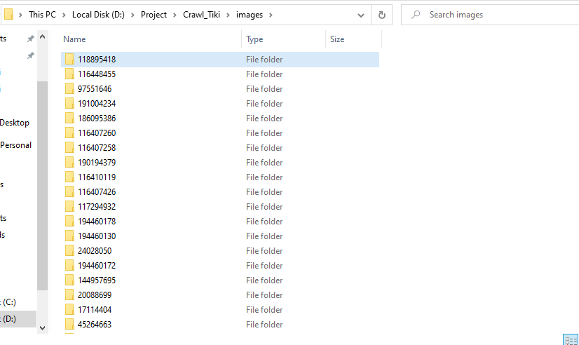

# [Python + MongoDB] Crawl products in Tiki

## Introduction

## How to use my project

Step 1 : Clone my project :

`git clone https://github.com/thangnh1/Crawl_Tiki`

Step 2 : Open with editor tool, install lib

`pip install -r requirements.txt`

Step 3 : Config connection in `config.py` 

Step 4 : Run command `python crawling_data.py`, data will be saved to MongoDB and images will be saved to images folder

Step 5 : Run command `python count_product.py`, result will be saved to result.txt

## Demo

   
   
  <i>All product in MongoDB</i>

   
  <i>Images</i>

   
  <i>Result count product by category</i>

